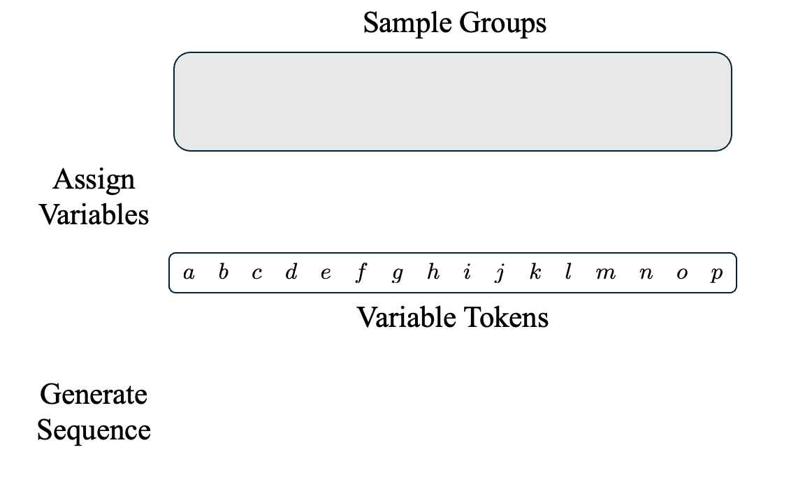

# In-Context Algebra

###  [Project Website](https://algebra.baulab.info) | [Arxiv Preprint](https://arxiv.org/abs/2512.16902) | [Model Weights](https://algebra.baulab.info/weights) | [OpenReview](https://openreview.net/forum?id=J2peqXPQbB) <br>

<div align='center'>
<!--  -->

</div>

## Setup

We use conda as a package manager. 
The environment used for this project can be found in `env/algebra.yml`.
To install, you can run: 
```
conda env create -f algebra.yml
conda activate algebra
```

## Code
Our code is split into two parts:

- The `experiments` directory contains notebooks with code for reproducing results/figures in the paper, including analysis of different mechanisms, empirical coverage, and model performance.

- The `src` directory contains the main codebase, with util files for  training models, data generation, experiments, and analysis.

## Data
The in-context algebra task involves simulating a mixture of finite algebraic structures. The models we analyze are trained on groups (mostly Cyclic + Dihedral groups), but we test our models on non-group structures as well.
Our data-generating code + more details can be found in the [`src/tasks`](/src/tasks) directory.


## Models

### Download Pre-Trained Algebra Models
You can download the model analyzed in our paper from [algebra.baulab.info/weights/](https://algebra.baulab.info/weights/).

The `mixrosette-facts-10-16-8heads/` directory contains the trained model weights (`algebra_gpt_best.pt`), training checkpoints, and a `metadata.json` file with training configuration details. See `src/load_utils.py` or the experiment notebooks for examples of how to load these models. 

At a minimum, you'll need to download the `metadata.json`, and at least one set of model weights (e.g. `algebra_gpt_best.pt`). See below for a minimal file structure for running the experiment notebooks.

```
outputs/
└── mixrosette-facts-10-16-8heads/
    ├── models/
    │   └── algebra_gpt_best.pt    # Best checkpoint
    └── metadata.json              # Training configuration
```

**Note:** I'm also looking into hosting these models on HuggingFace and will update later with more info.

### Train Your Own Algebra Model
To train your own algebra model with checkpoints, you can use the `training.py` script (see the companion script `train_mix_10.sh` for an example). We use `wandb` to track training metrics and details.


## Citing our work
This work appeared at ICLR 2026. The paper can be cited as follows:

```bibtex
@inproceedings{todd2026incontext,
    title={In-Context Algebra},
    author={Eric Todd and Jannik Brinkmann and Rohit Gandikota and David Bau},
    booktitle={The Fourteenth International Conference on Learning Representations},
    url={https://openreview.net/forum?id=J2peqXPQbB},
    year={2026},
    note={arXiv:2512.16902}
}
```
<!-- 
```bibtex
@misc{todd2025incontextalgebra,
    title={In-Context Algebra}, 
    author={Eric Todd and Jannik Brinkmann and Rohit Gandikota and David Bau},
    year={2025},
    eprint={2512.16902},
    archivePrefix={arXiv},
    primaryClass={cs.CL},
    url={https://arxiv.org/abs/2512.16902},
}
``` -->
